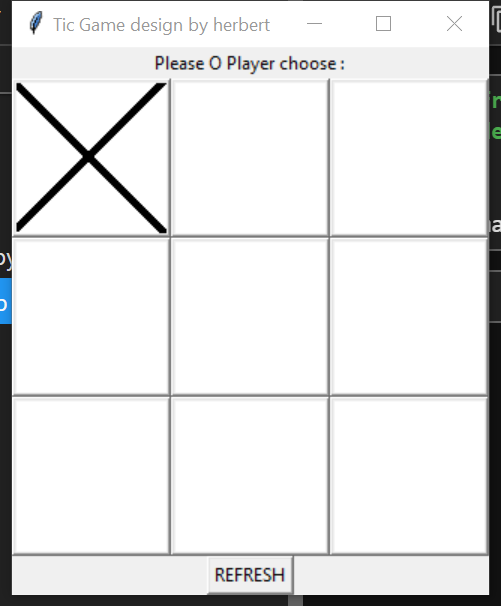
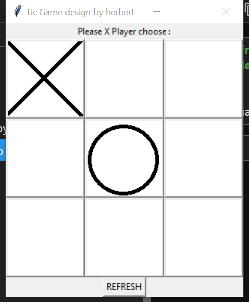
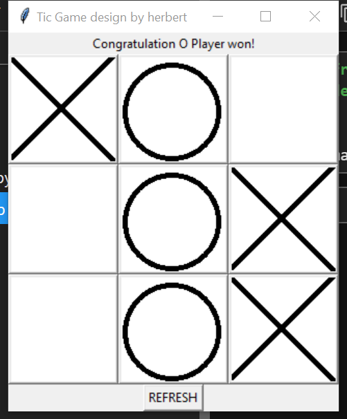
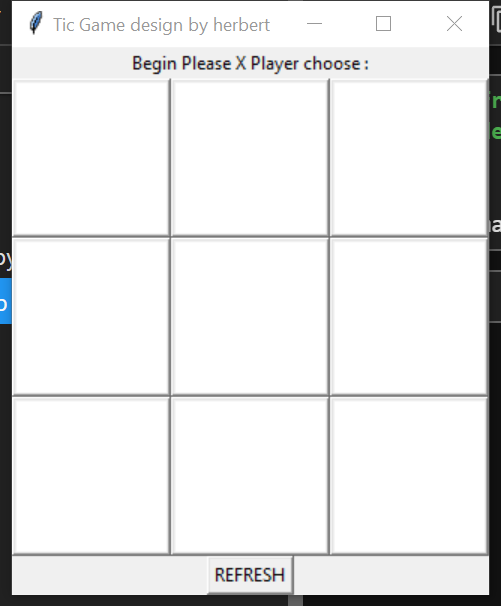
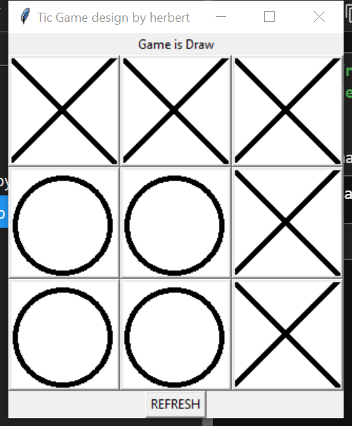

# tic-tac-toe
Design a tic-tac-toe game by python(GUI)

## There are five files for the game
- The X, O and blank images.
- TicgameGUI.py file which is a class contains all the functions needed.
- The testtic file that if you want to play the game you need run this.
- The aim of the game is that who can first draw three symbols in a line.

**The game shows as follow:**

**first X player choice a situation**

**then O player choice a blan**

**when one player draw a line then he wins.**

**use refresh button to restart a game**

**if no one can win if fill in all the blanks,then they are draw.**

